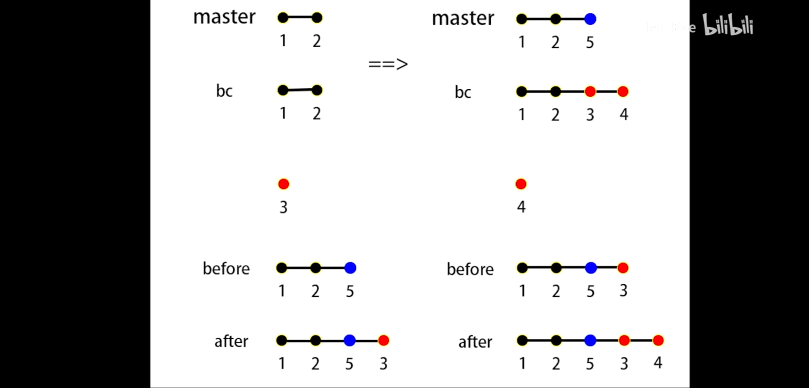

#### 不同分支

首先在bc分支上输入git rebase master 会产生冲突 3和5 冲突  之后可以选择3解决冲突

输入git add 将变更加入到暂存区  再执行git rebase --continue

#### [想要通过git rebase 合并提交](https://www.cnblogs.com/amou/p/9465880.html)

在终端输入: `git rebase -i HEAD~2`  这里的 `HEAD~2` 表示合并最近两次的提交, 如果想合并最近三次的提交修改为: `git rebase -i HEAD~3`![

