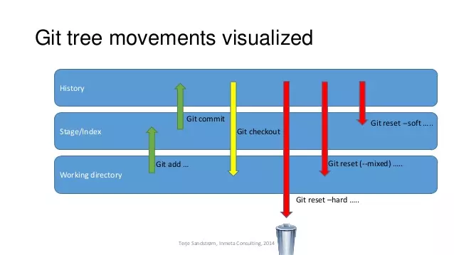

> 新增加文件untracked状态  工作目录中的被修改状态(modified)     stage暂存区状态(add)   
>
> repository仓库状态(commit)

#### git reset xx --hard

- 放弃所有更改

- 重置位置的同时，直接将 **working Tree工作目录**、 **index 暂存区**及 **repository** 都重置成目标**Reset**节点的內容,所以效果看起来等同于清空暂存区和工作区

#### git reset xx --mixed(git reset xx默认就是mixed)

- 保存差异，放入工作目录，也就是modified被修改状态，没有add，是放入stage暂存区之前的状态
- 重置位置的同时，只保留**Working Tree工作目录**的內容，但会将 **Index暂存区** 和 **Repository** 中的內容更改和reset目标节点一致，因此原节点和**Reset**节点之间的【差异变更集】会放入**Working Tree工作目录**中。所以效果看起来就是原节点和**Reset**节点之间的所有差异都会放到工作目录中。

#### git reset xx --soft

- 保存差异，放入git add 后的那个stage缓存区，还没有commit提交到本地仓库

- 重置位置的同时，保留**working Tree工作目录**和**index暂存区**的内容，只让**repository**中的内容和 **reset** 目标节点保持一致，因此原节点和**reset**节点之间的【差异变更集】会放入**index暂存区**中(**Staged files**)。所以效果看起来就是工作目录的内容不变，暂存区原有的内容也不变，只是原节点和**Reset**节点之间的所有差异都会放到暂存区中。

#### 使用场景

1. --hard 
   - **要放弃目前本地的所有改变時**，即去掉所有add到暂存区的文件和工作区的文件，可以执行 **git reset -hard xx** 来强制恢复git管理的文件夹的內容及状态
   - **真的想抛弃目标节点后的所有commit**（可能觉得目标节点到原节点之间的commit提交都是错了，之前所有的commit有问题）。
2. --mixed
3. --soft