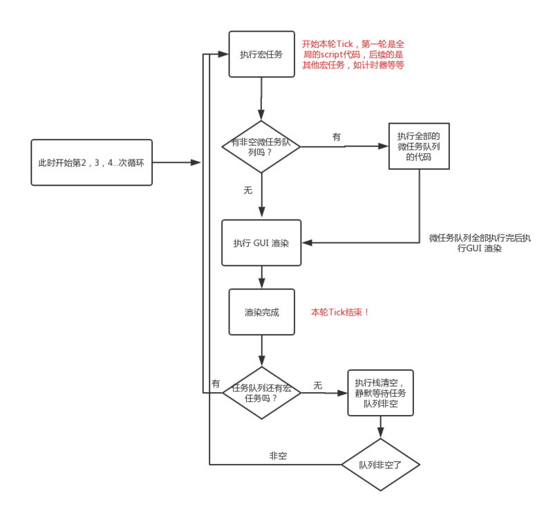

1. 开始执行，首先执行第一个宏任务：全局中的代码，遇到异步代码就交给相应的异步工作线程执行；
2. 执行到</script>，结束第一个宏任务，查看微任务队列，若有微任务，按顺序清空。若没有微任务，就执行UI Render渲染DOM，此时就完成了一次Loop/Tick；
3. 继续查找宏任务队列并执行

**由此看出，并不是很多文章所谓的先执行微任务再执行宏任务！而是执行下一个宏任务之前，必须把微任务队列给清空了！而进入代码执行的第一个任务就是宏任务（script整体）！而每执行一个宏任务，就是一个新的Loop/Tick**

**GUI是layout(重排)和painting(重绘)的过程 所以GUI之前  DOM Tree是已经存在的**

Vue的异步渲染是将所有的变化更新渲染函数用nextTick执行

nextTick异步API优先考虑Promise，其次MutationObserver，如果没有MutationObserver的话，会考虑setImmediate，没有setImmediate的话最后考虑是setTimeout。

假如是微任务,会在GUI之前执行完，我们自己手动使用的nextTick是可以在GUI渲染之前拿到更新过的DOM Tree的,

所以比如this.msg='hi'这样子修改数据  然后直接获取dom，这时候获取的是之前的dom,而如果在nextTick里面获取dom是新的dom，是异步渲染之后的dom

[node端Event Loop](https://juejin.im/post/6844903761949753352#heading-23)

[setTimeout和setImmediate到底谁先执行，本文让你彻底理解Event Loop](https://juejin.im/post/6844904100195205133)

如果是node11版本一旦执行一个阶段里的一个宏任务(setTimeout,setInterval和setImmediate)就立刻执行微任务队列，这就跟浏览器端运行一致

如果是node10及其之前版本：要看第一个定时器(宏任务)执行完，第二个定时器是否在完成队列中，在那就直接一起执行了