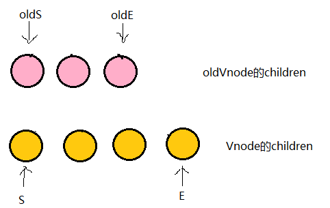

优化时间复杂度到O(n)

1. 只比较同一层级，不跨级比较（和React一样）
2. tag不相同，则直接删除重建，不再深度比较
4. tag和key，两者都相同，则认为是相同节点，不再深度比较

即便同一个节点元素比如div，他的`className`不同，Vue就认为是两个不同类型的节点，执行删除旧节点、插入新节点操作。这与react diff实现是不同的，react对于同一个节点元素认为是同一类型节点，只更新其节点上的属性

Vue是两端至中间的对比方法，这种方法与react的`updateChildren`实现也是不同，后者是从左至右依次进行对比，各有优点。
 比如一个集合，只是把最后一个节点移到了第一个，react实现就出现了短板，react会依次移动前三个节点到对应的位置：

而Vue会在首尾对比时，只移动最后一个节点到第一位即可

### [Vue diff](https://www.cnblogs.com/wind-lanyan/p/9061684.html)

https://segmentfault.com/a/1190000008782928 加了key 复用节点	

现在分别对`oldS、oldE、S、E`两两做`sameVnode`比较，有四种比较方式(S oldS ,S oldE,E oldS,E oldE)，当其中两个能匹配上那么真实dom中的相应节点会移到Vnode相应的位置，这句话有点绕，打个比方

- 如果是oldS和E匹配上了，那么真实dom中的第一个节点会移到最后
- 如果是oldE和S匹配上了，那么真实dom中的最后一个节点会移到最前，匹配上的两个指针向中间移动
- 如果四种匹配没有一对是成功的，那么遍历`oldChild`，`S`挨个和他们匹配，匹配成功就在真实dom中将成功的节点移到最前面(这里肯定是加了key才可以复用)，如果依旧没有成功的，那么将`S对应的节点`插入到dom中对应的`oldS`位置，`oldS`和`S`指针向中间移动。

